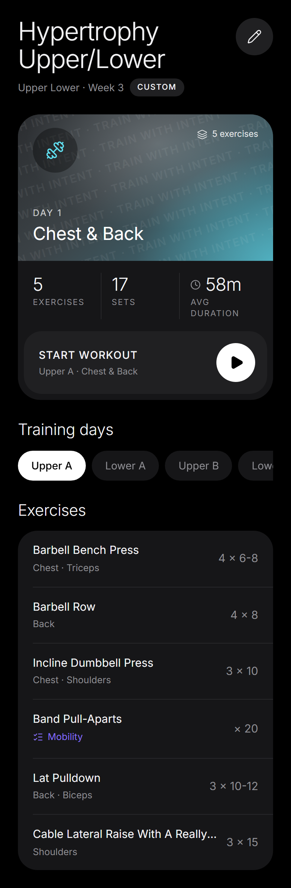

# Trainient App Design — "Sessions"

The visual language for Trainient's screens going forward. **Pure black canvas,
soft rounded grey cards, thin light Inter headings, pill-shaped controls, and
white-on-black for whatever is selected or primary.** It reads as a calm,
premium iOS app: almost monochrome, with one cool teal accent.

Agents building or restyling a screen should follow this file. When the doc and
the code disagree, the reference screen's code wins:

- **Reference screen:** the program page — `artifacts/traintent/src/pages/program/shared.tsx`
  (`ProgramWeekView`, `RosterRow`, `ProgramPageShell`, `ProgramBadge`, `InactiveLineageNotice`)
- **Tokens and helpers:** `artifacts/traintent/src/index.css` (`.theme-sessions`, `.sessions-glass`, `.sessions-watermark`)
- **Screenshots:** [mobile](docs/design/references/program-page-mobile.png) · [desktop](docs/design/references/program-page-desktop.png)
- **Approved mockup** (the design review this came from, open in a browser): [program-page-mockup.html](docs/design/references/program-page-mockup.html)



> Relationship to Voltage: `docs/design/voltage-style.md` describes the older
> navy/electric-blue theme, which is still the app-wide default. Sessions replaces it
> screen by screen. New or reworked screens use Sessions, and Voltage stays in place
> for untouched screens until they're migrated.

---

## 1. How to apply it to a screen

Sessions is a **scoped token override**, not a new component library. Wrap the
screen in the `theme-sessions` class and every semantic Tailwind token inside
(`bg-card`, `bg-secondary`, `text-muted-foreground`, `border-border`,
`bg-primary`, …) re-skins itself. shadcn components come along for free.

```tsx
// the program page's wrapper - copy the pattern for other screens
<div className="theme-sessions min-h-screen bg-background text-foreground">
  <div className="mx-auto max-w-3xl space-y-6 p-6">{children}</div>
</div>
```

For the program routes this wrapper is `ProgramPageShell`. Put **every state**
of a route inside it (loading, empty, editing, the main view) so the screen
never flashes the old navy theme between states.

Rules:

- **Use tokens, never hex or palette classes** (`bg-zinc-900`, `text-blue-400`).
  The only literal colours allowed are `bg-white` / `text-black` for selected
  and primary states, and `text-white/xx` on top of the hero glass.
- **No glows.** No coloured `box-shadow` halos and no `.glow-primary`. Depth comes
  from the step between surface greys, not from light.
- Keep the app's existing structure and behaviour. Sessions changes how a screen
  looks, not what it does.

## 2. Tokens (`.dark .theme-sessions` in `index.css`)

| Token | HSL | Hex ≈ | Use |
|---|---|---|---|
| `--background` | `0 0% 0%` | `#000000` | the canvas |
| `--card` | `240 4% 9%` | `#161618` | primary surface: cards, grouped lists, notices |
| `--secondary` / `--muted` | `240 4% 13%` | `#1f1f22` | surface *on* a card: icon circles, the Start-workout row, inputs, badges |
| `--accent` | `240 4% 17%` | `#2a2a2e` | hover state of a `secondary` surface |
| `--border` | `240 4% 16%` | `#262629` | hairline separators only |
| `--foreground` | `240 11% 96%` | `#f5f5f7` | primary text |
| `--muted-foreground` | `240 2% 57%` | `#8e8e93` | secondary text, captions, trailing values |
| `--primary` | `0 0% 100%` | white | primary action fill (paired with black text) |
| `--primary-foreground` | `0 0% 0%` | black | text on primary |
| `--sessions-cyan` | `187 83% 66%` | `#5fe0f0` | **the only accent**: hero glass, hero icon, AI badge |

Surfaces go up in three steps: **black → card → secondary**. A control sitting on
a card uses `secondary`. A card sitting on the page uses `card`. Don't put a card
on a card of the same grey.

Category and muscle colours (`--chart-*`, `categoryMeta().token`) are still
allowed as **small signals**, like the check icon and label on a checklist row,
but never as fills for large areas.

## 3. Type

**Inter only.** `.theme-sessions` switches headings and `font-display` from Space
Grotesk to Inter. The contrast comes from weight and size, not from a second face.

| Role | Classes |
|---|---|
| Screen title | `text-[34px] font-light leading-[1.08] tracking-[-0.025em]` (export `PROGRAM_TITLE_CLASS`) |
| Section title ("Training days", "Exercises") | `text-[21px] font-light tracking-[-0.01em]`, `mb-3` |
| Hero title | `text-2xl font-normal tracking-[-0.01em]` |
| Big stat number | `text-2xl font-light tracking-[-0.02em]` |
| Caps label (stat labels, eyebrow, CTA) | `text-[11px] uppercase tracking-[0.1em]`, up to `0.14em` for short eyebrows |
| Row title | `text-[15px] font-normal` |
| Row subtitle | `text-[12.5px] text-muted-foreground` |
| Body / notice | `text-[12.5px]` – `text-sm`, `leading-relaxed` |

Light (300) is for big display text only. Body text stays at 400–500 so it
stays readable on black. Inter 300 is loaded in `artifacts/traintent/index.html`.

## 4. Shape and spacing

- **Radii are large and soft:** hero `rounded-[30px]`, grouped list `rounded-[26px]`,
  inner row or sheet `rounded-3xl`, notice `rounded-[22px]`.
- **Pills everywhere for controls:** tabs, badges and buttons are `rounded-full`.
- **Circles for icon actions:** `h-[50px] w-[50px] rounded-full bg-secondary` with a
  20px lucide icon at `strokeWidth={1.6}`. The icon-only button *must* have `aria-label`.
- Page gutter is `p-6`, sections are `space-y-6`, and a section title sits `mb-3` above its content.
- Icons are lucide with thin strokes (`strokeWidth={1.6}`), matching the light type.

## 5. Components (as built on the program page)

**Header:** title on the left, round icon button on the right (Edit). Under the
title, a muted meta line ("Upper Lower · Week 3") followed by a pill badge.

**Badge (`ProgramBadge`):** `rounded-full px-2.5 py-1 text-[10.5px] uppercase
tracking-[0.1em] font-medium`. AI gets a cyan tint (`bg-[hsl(var(--sessions-cyan)/0.1)]`
with cyan text). Everything else gets `bg-secondary text-foreground`.

**Hero card:** one `rounded-[30px] bg-card` card in three bands:
1. `.sessions-glass` top (196px). The grey-to-teal frosted gradient, with the
   faint diagonal `.sessions-watermark` slogan ("Train with intent", `aria-hidden`).
   A 60px dark glass circle holds the icon in cyan, a small meta chip sits top
   right, and an eyebrow plus title sit bottom left in white.
2. A stats band: equal `flex-1` columns split by `border-l border-border`, each a
   big light number over a caps label.
3. The **primary action as a bottom-sheet row**: `bg-secondary rounded-3xl`
   inset `mx-2 mb-2`, with a caps title plus muted subtitle on the left and a **white
   52px play circle** on the right. The whole row is the button.

**Tabs / segmented choice:** a horizontal row of `rounded-full px-[18px] py-2.5`
pills that scrolls sideways (`overflow-x-auto`, scrollbar hidden). Selected pills
are `bg-white text-black font-medium`, the rest `bg-card text-muted-foreground`.
Set `aria-pressed` on each. Never squeeze tabs into equal columns; let them scroll.

**Inset grouped list (`RosterRow`):** the default way to show a list of items.
One `rounded-[26px] bg-card overflow-hidden` card with rows like this:

```tsx
<div className="group flex items-center pl-5">
  <div className="flex min-w-0 flex-1 items-center gap-3 border-b border-border py-[15px] pr-5 group-last:border-b-0">
    <div className="min-w-0 flex-1">{/* title + subtitle, both truncate */}</div>
    <span className="whitespace-nowrap text-[15px] text-muted-foreground">{/* trailing value */}</span>
  </div>
</div>
```

The hairline sits on the *inner* block, so it starts at the text inset like an
iOS grouped list, and the last row has none. **No leading numbers or colour bars.**
The trailing value (sets × reps, a target) is quiet muted text, not a chip.

**Notice / info card:** `rounded-[22px] bg-card px-4 py-3.5`, a muted 16px
icon, `text-[12.5px]` muted copy, and links as `text-foreground underline underline-offset-[3px]`.

**Primary button (standalone):** `h-[52px] rounded-full bg-primary px-8 text-sm
font-semibold uppercase tracking-[0.06em] text-primary-foreground`, which is white
with black text. Secondary actions are either an outlined pill
(`border border-foreground/90 bg-transparent`) or a `bg-secondary` pill.

## 6. Interaction and UX

- Selection is always **white fill with black text**. Don't use colour to show "selected".
- Motion stays small and quick: `framer-motion` fade plus an 8–12px slide, around 200ms,
  re-keyed when the content changes (for example switching day).
- Hover is a surface step up (`hover:bg-accent`) or text going from muted to foreground.
  Nothing scales or glows.
- Every text line inside a flex row needs `min-w-0` + `truncate` on the flexible
  child and `whitespace-nowrap` on the trailing value. Check at a 390px width.
- Keep existing `data-testid`s when restyling. Tours and tests depend on them.

## 7. Checklist for restyling a screen

1. Wrap every state of the route in `theme-sessions` (or reuse `ProgramPageShell`).
2. Swap heading classes to the type scale above, and drop `font-bold` / `font-display` on titles.
3. Turn bordered cards into borderless `bg-card` cards with large radii. Keep hairlines only between rows.
4. Replace coloured selected states and CTAs with the white-on-black pattern.
5. Remove glows, gradient borders and coloured edge bars.
6. Render at 390px and desktop: no horizontal overflow, nothing clipped, and the icon-only buttons labelled.

**Date arc + wash (dashboard):** the top of the dashboard (`WeekStrip` in
`components/dashboard/`) is the week on a shallow arc, taken from the calendar row
of [calendar_dashboard_example.jpg](docs/design/references/calendar_dashboard_example.jpg)
but recoloured to Sessions. Seven circles, Monday-first. A logged session fills its
circle (`bg-white/[0.16]`), a planned session is outlined, a rest day is dashed,
and today is larger with a thin white ring. The ring shows no progress; it only
marks the day. The outer days sink (`1.5px × offset²`) and fade slightly. Above the arc,
the white Intent sun (`src/assets/intent-sun.png`, from [intent-logo.png](docs/design/references/intent-logo.png))
and the word "Intent" sit on the left, with a "Full month" chip on the right. Behind it,
`.sessions-wash` is a grey-to-teal light that fades into black, and the greeting
sits straight on it with no card. Screenshots: [mobile](docs/design/references/dashboard-mobile.png) ·
[desktop](docs/design/references/dashboard-desktop.png).

## 8. Not yet migrated / open

- `/program` (AI + My program pages, including the builder and empty states)
  and the dashboard (`/`, including the day sheet and Independent targets card)
  use Sessions. The sidebar, mobile tab bar and other pages are still Voltage.
- The program page's **week strip** (`ScheduleStrip`) is parked. It's still in the
  code but nothing renders it, until a reworked week view is designed.
- Per-day colours (Settings → calendar colours) still paint the calendar and the
  program builder, but not the program page's view mode.
